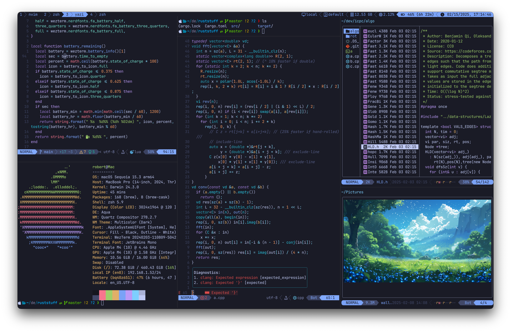

# my dotfiles



# Setup

Managing dotfiles with stow:

```sh
brew install stow
cd dotfiles # assumed inside ~/
stow vim # example, stow what you need
```

# Packages

```sh
brew install clipboard fastfetch fzf gcc gh glow neovim node powerlevel10k python ripgrep rust stow tree-sitter wget yazi zoxide
brew install --cask alt-tab discord firefox middleclick obsidian topnotch wezterm

# yazi dependencies
brew install yazi ffmpeg sevenzip jq poppler fd ripgrep fzf zoxide imagemagick font-symbols-only-nerd-font
ya pack -i # yazi plugins
```
